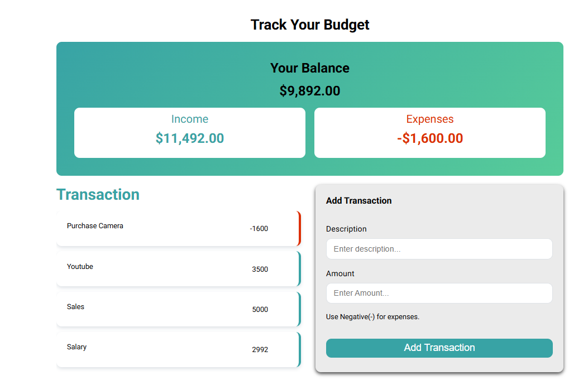

# This is a simle budegt tracking app build using HTML, css, and Javascript.

In this project i improve my skills on how to update the DOM and also get data from the DOM based on a user input.

I improve my skills of working with some javascript method like the reduce method and the filter method.

It was an amazing project to help me learn and master the fundamental of javascript. This was  the main reason behind doing this project.

If i could start over, i would implement the option for the user to add the receipt of each expense for example if they purchase something, they can juts take a picture of the receipt to upload, so they can keep track what thay they purchase and also about the receipt. 

# I will create this project with django so real user can use it and work with it. I will implement the receipt upload the catergory filter and user accoun, etc... 
